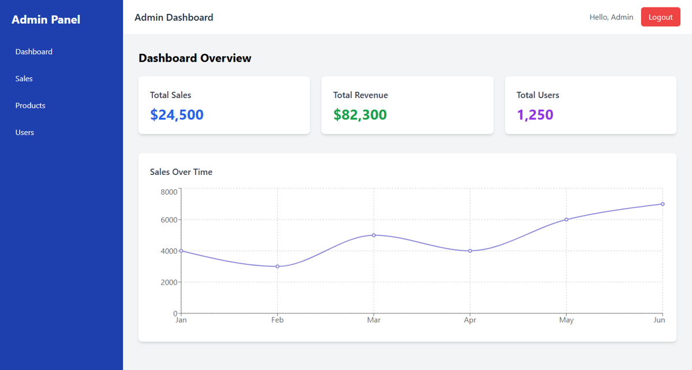

# Admin Dashboard Panel

Admin Dashboard responsif yang dibangun menggunakan **React.js**, **TailwindCSS**, dan **Recharts**.  
Project ini menampilkan panel statistik penjualan dengan halaman-halaman utama seperti Dashboard, Sales, Products, dan Users.



## 🔗 Live Demo

👉 [Klik untuk lihat demo langsung](https://admin-dashboard-vercel-xi.vercel.app)

## ✨ Fitur

- Sidebar navigasi yang responsif
- Navbar atas dengan tampilan bersih
- Halaman Dashboard dengan grafik penjualan (LineChart)
- Halaman Sales dengan grafik BarChart
- Halaman Products (grid produk)
- Halaman Users (tabel data pengguna)
- Routing dengan React Router DOM
- Styling full menggunakan TailwindCSS

## ⚙️ Teknologi yang Digunakan

- React.js
- Vite
- Tailwind CSS
- Recharts
- React Router DOM
- Vercel (Deployment)

## 🚀 Cara Menjalankan Project di Lokal

```bash
# Clone repository
git clone https://github.com/Bayufp/admin-dashboard-vercel.git
cd admin-dashboard-vercel

# Install dependency
npm install

# Jalankan development server
npm run dev
```

## 📁 Struktur Folder

```
src/
├── components/
│   ├── Navbar.jsx
│   └── Sidebar.jsx
├── pages/
│   ├── Dashboard.jsx
│   ├── Sales.jsx
│   ├── Products.jsx
│   └── Users.jsx
├── App.jsx
├── main.jsx
└── index.css
```

## 📝 Lisensi

Project ini dilisensikan di bawah MIT License.

## © 2025 – Bayu Fajar Pradana
